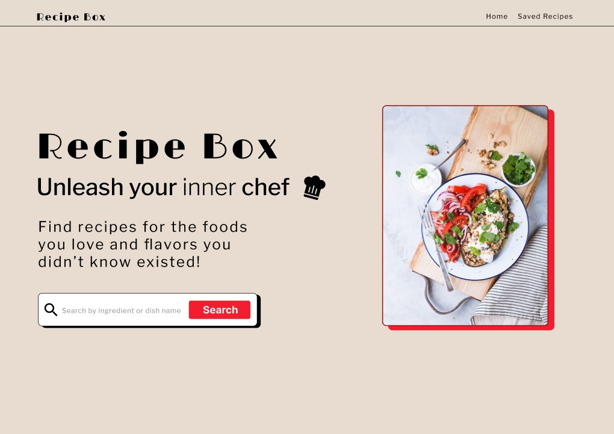

# Recipe Box

Table of Contents

- [Overview](#overview)
- [Features](#features)
- [Running This Project Locally](#running-the-project)
- [Tools and technologies](#tools-and-technologies)
- [Development Team](#development-team)

## Live Site
Check out [Recipe Box](https://chingurecipebox.netlify.app/) at https://chingurecipebox.netlify.app/

## Overview

Recipe Box is a web application developed to help anyone interested in creating dishes and flavors to explore recipes in novel ways. It leverages the power of the tasty RapidAPI for retrieving and managing a wide range of recipes. 
Recipe was designed and developed by our team with the Agile Methodology in Chingu Voyage 46.

## Features

The Recipe Box application allows users to search, view, and save recipes. The main features of the application are
 * Header component displaying a welcome message.
 * Search field that enables users to input ingredient(s). 
 * A scrollable list of recipes displaying the results based on the search criteria. Keep in mind that the Recipe API has over 1500 Recipes, however, it's paginated with 20 recipes per page of result.
 * A summary main recipe component: it should display recipe image, name and link to details. Display result for each recipe in the main component.
 * A summary detail recipe component: it should display recipe name, category, instructions, and nutrition.
 * Save recipes to favorites list.
 * Ensure mobile responsiveness for the application.
 

## Running the Project

For those interested in running the project locally

* Create a fork of the repo
* Clone your forked repo locally `git clone` 
* cd into the cloned directory
* Run `npm install` to install all the dependencies
* Run `npm run dev` and follow the local link

## Tools and technologies

* [React v18.2](https://react.dev/)
* [Vite](https://vitejs.dev/)
* [JavaScript](https://developer.mozilla.org/en-US/docs/Web/JavaScript)
* [CSS](https://developer.mozilla.org/en-US/docs/Web/CSS)
* [Tasty - RapidAPI](https://rapidapi.com/apidojo/api/tasty)
* [React Router v6.17](https://reactrouter.com/en/main)
* [Figma](https://www.figma.com/) Design tool
* [Asana](https://asana.com/) Team project management tool

## Development Team

[**Moriah Walker**](https://github.com/MoriahSWalker)

[**Akashay Anand**](https://github.com/Akashay-Anand)

[**Greg Schoenberg**](https://github.com/GregNicholas)

## Ways to Contribute

For bug reports and feature requests, we use GitHub Issues. Feel free to submit your ideas or report issues:

[GitHub Issues](https://github.com/chingu-voyages/v46-tier2-team-21/issues)

## Development Team

[**Moriah Walker**](https://github.com/MoriahSWalker)

[**Akashay Anand**](https://github.com/Akashay-Anand)

[**Greg Schoenberg**](https://github.com/GregNicholas)

## Chingu Voyage Guide 

[**Christopher Conway**](https://github.com/ConwayCJ)

## Ways to Contribute

For bug reports and feature requests, we use GitHub Issues. Feel free to submit your ideas or report issues:

[GitHub Issues](https://github.com/chingu-voyages/v46-tier2-team-21/issues)

## Learning Resources

- [MDN javascript documentation](https://)
- [Node JavaScript Reference](https://nodejs.dev/en/learn/how-much-javascript-do-you-need-to-know-to-use-nodejs) 
- [Event Loop Concept](latentflip.com/loupe/)
- [ReactJs Documentation](https://react.dev/learn)
- [Vite](https://vitejs.dev/guide/)
- [vite doc](https://devdocs.io/vite/guide/index)
